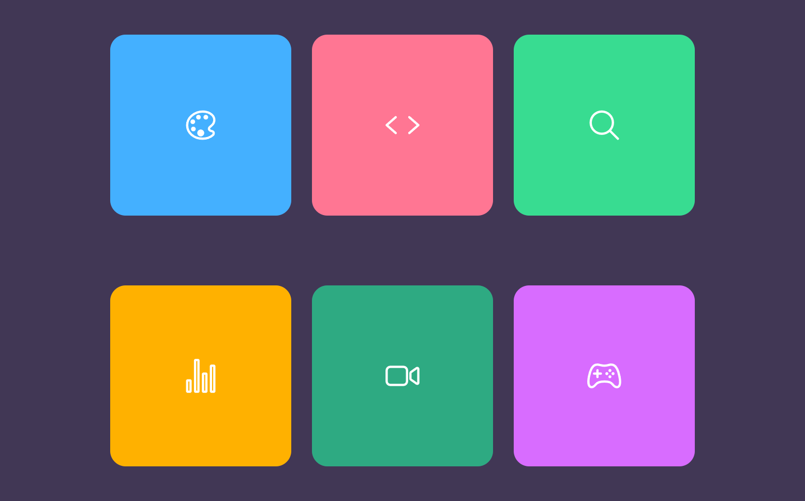

# Colors Cards

This project is about colored cards with an icon in the center. It is made with HTML, CSS and Sass
 
# Screen Project  
<div align="center">

</div>


# Install
```sh
git clone https://github.com/asalinasf/colors-cards/
cd colors-cards
open in your browse
```

# Visit my project with this url

https://cards-aaron.netlify.app/
